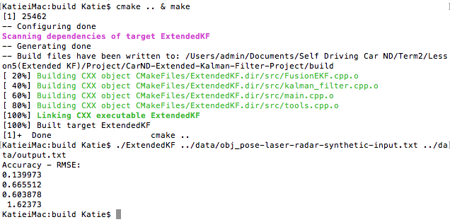

# Unscented Kalman Filter Project 
Implement a C++ based Unscented Kalman Filter for Lidar/Radar data. The Unscented Extended Kalman(UKF) filter is used for predicting the position of a bicycle. 

The EKF model uses a Jacobian Matrix to transform state from one co-ordinate system to another (non-linear to linear transform). This is a drawback and the system using the EKF model tends to fall apart because a significant deviation will cause the filter to diverge.

UKF handles non-linearity by representing the state mean and error covariance matrix (augmented with noise) as a set of sigma points. Non-linear equations can be applied to these sigma points directly instead of using a linear approximation. These transformed set of points, the mean and covariances of that set represents the predicted state of the target. 

[Here](http://ethw.org/First-Hand:The_Unscented_Transform) is a well written article about Unscented Transform and how it is used in a Kalman Filter

## Project Code
The project can be cloned or downloaded [here](https://github.com/spgitmonish/UnscentedKalmanFilter)

## Dependencies

* **cmake** >= 3.5
 * All OSes: [click here for installation instructions](https://cmake.org/install/)
* **make** >= 4.1
  * Linux: make is installed by default on most Linux distros
  * Mac: [install Xcode command line tools to get make](https://developer.apple.com/xcode/features/)
  * Windows: [Click here for installation instructions](http://gnuwin32.sourceforge.net/packages/make.htm)
* **gcc/g++** >= 5.4
  * Linux: gcc / g++ is installed by default on most Linux distros
  * Mac: same deal as make - [install Xcode command line tools]((https://developer.apple.com/xcode/features/)
  * Windows: recommend using [MinGW](http://www.mingw.org/)

## Basic Build Instructions

1. Clone this repo.
2. Make a build directory(delete any existing directories): `mkdir build && cd build`
3. Compile: `cmake .. && make` 
   * On windows, you may need to run: `cmake .. -G "MinGW Makefiles" && mingw32-make`
4. Run it: `./ExtendedKF path/to/input.txt path/to/output.txt`. You can find
   some sample inputs in 'data/'.
    - eg. `./ExtendedKF ../data/sample-laser-radar-measurement-data-1.txt output.txt`

*NOTE*: Regardless of the changes you make, your project must be buildable using
cmake and make!

## Project Folder Structure
* The breakdown is as follows:

	* *CmakeLists.txt*: Contains the configuration to run the project files using cmake and make.
	* */data*: Contains the data input files used for testing the model.
	* */src*: Contains all the source code
		* `main.cpp` - Reads in data, calls a function to run the Kalman filter, calls a function to calculate RMSE.
		* `ukf.cpp & .h` - Initializes the filter, calls the predict function, calls the update function.
		* `tools.cpp & .h` - Function to calculate RMSE
		* `measurement_package.h` - Class for sensor measurements
		* `ground_truth.h` - Class for storing ground truth measurements
	* */notebook*: Contains a python jupyter notebook for data analysis and visualization 

## 2-D Visualizer
Udacity has provided a way to visualize the effectiveness of a EKF model. The simulator can be downloaded here

[Windows](https://d17h27t6h515a5.cloudfront.net/topher/2017/March/58d07003_kalman-tracker-windows/kalman-tracker-windows.zip)

[Mac](https://d17h27t6h515a5.cloudfront.net/topher/2017/March/58d07064_kalman-tracker-mac.app/kalman-tracker-mac.app.zip)

[Linux](https://d17h27t6h515a5.cloudfront.net/topher/2017/March/58d96544_kalman-tracker-linux/kalman-tracker-linux.zip)

The Kalman Filter Tracker program is a visualization tool that plots noisy lidar and radar measurements as a simulated car drives in a figure eight pattern. The program can also record measurement data directly to a text file and then use a python script to call a compiled C++ Kalman Filter file to track estimated markers and RMSE values visually in real time.

### Usage instructions
Copy and Save [kalman-tracker.py](https://d17h27t6h515a5.cloudfront.net/topher/2017/March/58d07228_kalman-tracker/kalman-tracker.py) script code. This is used to communicate between the simulator and your compiled c++ kalman filter program. The script requires 1 argument which is the path to your compiled C++ file. Here is an example for how to call the script.

`python kalman_tracker.py ./main.out`

*NOTE*: There might be additional libraries required for running socket communication. This starter kit by udacity has all the libraries(and more) required to run the above code. The starter kit can be found here: [Environment Setup](https://github.com/udacity/CarND-Term1-Starter-Kit)

### Running the program
1. First open the simulator program (Preferred: Resolution of *1600 x 900* , Graphics Quality set to *Simple*)
2. Click **Record Data** in the simulator, a browser will then open to where you want to save your text file output. Make sure the path is the same as where `kalman_tracker.py` file is.
3. Run `kalman_tracker.py` with path to your compiled c++ file.
4. Click **Run** in the simulator to see estimation markers and RMSE values displayed in real time as measurement markers are collected.
5. Experiment with turning on/off lidar and radar measurements on the lower left of the simulator to see how RMSE is effected.

*Note about RMSE*: To display RMSE values on the simulator, turn on the flag `DEBUG_SIMULATOR_OUTPUT` in `main.cpp`. The output format expected by the simulator. 

## Filter Design
In this project, we have two sources of sensor data (Lidar and Radar). Lidar measures object position in x,y. Whereas, Radar measures angular velocity, angle and change of angular velocity of the object. As explained in the introduction, UKF works better when compared to EKF for non-linear data.

Radar data is in polar co-ordinates and without requiring non-linear to linear transforms, UKF outperforms EKF. Here is a comparison:

   

   <i>EKF</i>

   

   <i>UKF</i>

In fact, just using the individual sensors, UKF accuracy is better than EKF:

   

   <i>Lidar UKF</i>

   

   <i>Radar UKF</i>

The beauty of Kalman Filter design is that the update step can be different for different sensors. For predicted state mean and covariance, EKF uses a Jacobian Transform for Radar data but UKF uses augmented sigma points passed through non-linear functions.

## UKF Filter Tuning
For process noise covariance matrix, I did a binary search to find the optimal longtidual acceleration and yaw acceleration standard deviation(0.40, 1.20) . These values made sense when I correlated to the acceleration calculated from velocity and yaw in the data input file. These values make sense because the object being tracked is a bicycle and not a motorized vehicle. 

I set the initial process covariance to be an identity matrix. This matrix can be tuned as well to lead to even better RMSE. 

### Validation of tuning
Normalized Innovation Squared(NIS) is an equation to measure the accuracy of the filter. The output of the equation has a chi-squared distribution. The accuracy of the ouput can be visualized and compared against a threshold(in our case 95%) obtained from the chi-squared table(corresponding to the degrees of freedom).

My UKF design did really well. Here is a visualization of Lidar NIS and Radar NIS over time.

   

   <i>NIS</i>

*NOTE*: Lidar measurements are 2-D but Radar measurements are 3-D as mentioned earlier.

## Expected Ouput
I visualized how the filter performs with respect to various parameters predicted. 

   

   <i>Position</i>

   

   <i>Velocity</i>

   

   <i>Yaw</i>

   

   <i>Yaw Rate</i>

Except for yaw rate, UKF does really well in estimating position, velocity and yaw. Even with the Yaw Rate, the UKF filter is pretty close but the accuracy can be probably improved even further with more tuning.

## Simulation
I also validated my model using the 2-D visualizer. The visualizer is supposed to show green triangles for the estimations made by my model but for some reason, there was none. The visualizer did display RMSE data. Compared to EKF, UKF definitely does predict velocity more accurately. 

   

   <i>UKF</i>

   

   <i>EKF</i>

*NOTE*: The positional data generated by the visualizer is not the same everytime but the velocity is supposed to be close to the same. 

## Final thoughts
This model is based on Udacity's code skeleton. The final implementation was based on my design. I definitely optimized some of the code to prevent repetition and improve performance.